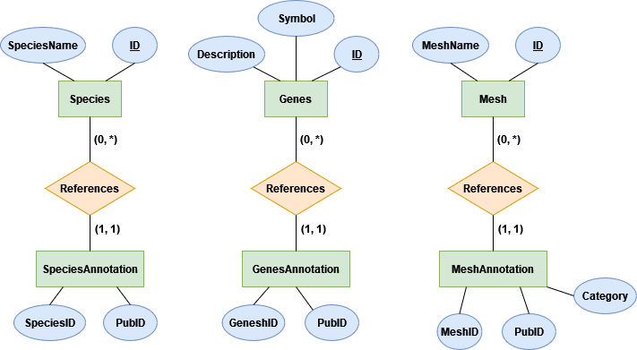

# Database for Pubmed 
Database for article annotations of pubmed from Pubtator FTP ([FTP](https://ftp.ncbi.nlm.nih.gov/pub/lu/PubTatorCentral/)) library. Is able to search various annotations of an article and gives results back in a .txt file.
## Database Setup



## Commands:
List of all Commands that can be entered into the program.

| Command | Parameters             | Description                                                                                  |
|---------|------------------------|----------------------------------------------------------------------------------------------|
| help    |                        | Gives all possible commands as printout in console                                           |
| gna     | \<id> \<type of id>    | Gives back name of ID. Type of ID can be [mesh, species, genes]                              |
| gra     | \<Category> \<Mesh ID> | Gives text file with all related annotations to searched mesh (Allows for multiple mesh ids) |   
| gap     | \<Pubmed ID>           | Gives all annotations of an article                                                          |
| gpm     | \<Mesh ID>             | Gives all Pubmed IDs containing given mesh as annotation                                     |
| quit    |                        | Quits the programm                                                                           |
## Local setup:

The paths of the Database and output can be specified through the `config_handler.json` file.

```JSON
{
db_path: "",
output_path: ""
}
```

## Dependecies

python version >= 3.11.5 <br>
sqlite3:  https://www.sqlite.org/index.html

